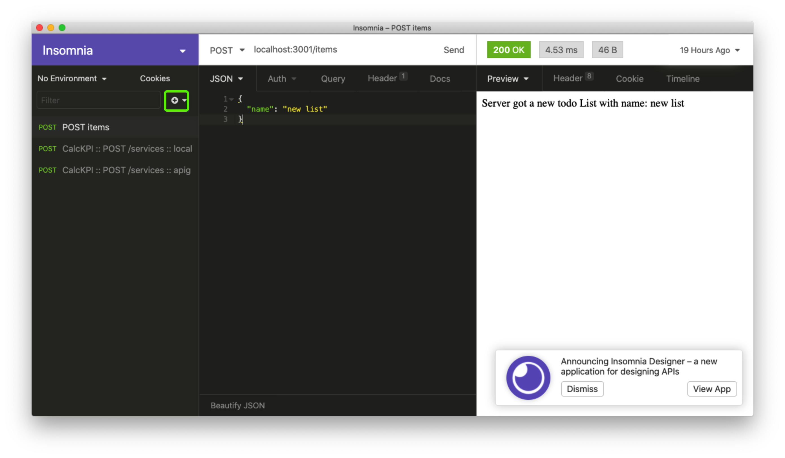

## POST request
While GET requests are used for fetching data from server, POST requests are used for posting new data to server. The data is sent as the body part of POST requests.

JSON is a common data format for POST request body.

### How to write POST request handler in Expressjs
```js
app.post("/items", (request, response) => {
    console.log(request.body)
    response.send("Server got a new todo List")
})
```

### How to test a HTTP server without browser
We can use applications like Insomnia or Postman. They act as a HTTP client and alow users to form and send HTTP requests.

For example, following steps demonstrate how to create a POST request with JSON body to http://localhost:3000/items
1. Press (+) button or press CMD+N to create a new request


2. In request type drop down, choose "POST"


3. In Body drop down, choose JSON


4. Finally, in URL bar, enter the request URL


### How to write a POST request using fetch library
```js
const requestBody = {
    "name": "MyNewToDoList"
}
const requestOptions = {
    method: 'POST',  // by default, if you don't set it, it will be GET
    body: JSON.stringify(requestBody)
}
// How to send this body to server using POST request?
fetch('http://127.0.0.1:3000/items', requestOptions)
```

## Homework
### Ha
1. Create a 10 minutes presentation for what you have learnt about pathway analysis during the week
2. Rewrite last project with React

### Nam
1. Create 10 minutes presentations for what you have learnt about database, networking, and Redux during the week

### All
Next progression for the coding project
1. Create a form for adding new todo list + server handler
    - When the submit button is clicked, send a POST request to server
    - The server appends new todo list to the data.json file
2. For each todo list, creat a form for adding new item + server handler
    - When the submit button is clocked, send a POST request to server
    - The server append new item to the list